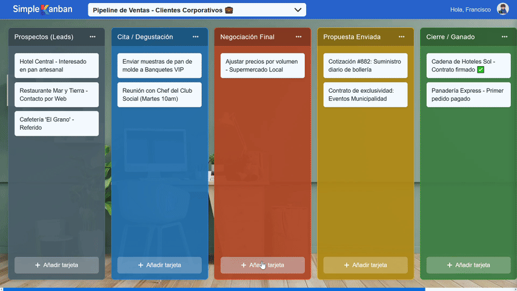

# Taskboard App

[](https://simple-kanban-taskboard-app.vercel.app/)

Una aplicación web moderna y completa tipo Kanban para la gestión de tareas, construida con el stack MERN (MongoDB, Express, React, Node.js) y totalmente dockerizada para un despliegue y desarrollo sencillos.

<!-- TODO: Coloca tu GIF principal como 'demo-hero.gif' en la carpeta 'assets' -->
### 🚀 Demo Rápida


<!-- TODO: Coloca una miniatura de tu video como 'video-thumbnail.png' en 'assets' y actualiza el enlace de YouTube -->
### 🎥 Video Demostrativo de las funciones principales
[Ver Video Completo](https://github.com/user-attachments/assets/db1123ca-59e9-4c88-bca6-7bb77776da04)
> *Haz clic en el enlace para ver el recorrido completo de la aplicación.*

---

## ✨ Características Principales

*   **Gestión Completa de Tableros:** Crea, renombra, elimina y reordena múltiples tableros de trabajo.
*   **Columnas y Tarjetas Dinámicas:** Añade, edita y elimina columnas y tarjetas con facilidad.
*   **Arrastrar y Soltar (Drag & Drop):** Reorganiza columnas y tarjetas de forma intuitiva gracias a `dnd-kit`.
*   **Autenticación Robusta:**
    *   Registro de usuarios con verificación por correo electrónico.
    *   Inicio de sesión con Email/Contraseña y Google (OAuth 2.0).
    *   Sistema seguro de tokens (Access y Refresh Tokens) con cookies `HttpOnly`.
    *   Funcionalidad de "Olvidé mi contraseña".
    <br>
    <!-- TODO: Coloca captura del login como 'feature-auth.png' -->
    

*   **Personalización:**
    *   Sube tus propios fondos de pantalla.
    *   Selecciona entre una galería de fondos predefinidos.
    *   Cambia el color de las columnas.
    *   **Tema claro y oscuro:** Adapta la interfaz a tu preferencia.
    <br>
    <!-- TODO: Coloca captura del modo oscuro como 'feature-darkmode.webp' -->
    
    <br>
    <!-- TODO: Coloca captura del modal de wallpapers como 'feature-wallpapers.png' -->
    

*   **Modo Invitado (Offline):** Funcionalidad completa de un tablero sin necesidad de registro, con persistencia de datos en el `localStorage` del navegador.
*   **Seguridad:**
    *   Protección contra ataques de fuerza bruta (Rate Limiting).
    *   Sanitización de entradas en el backend para prevenir XSS.
    *   Contraseñas hasheadas con `bcrypt`.
*   **Dockerizado:** Entorno de desarrollo y producción completamente contenedorizado con Docker y Docker Compose.

---

## 🛠️ Tecnologías Utilizadas

*   **Frontend:**
    *   **React.js** (con Hooks y Context API)
    *   **Vite:** Entorno de desarrollo frontend ultrarrápido.
    *   **dnd-kit:** Para la funcionalidad de arrastrar y soltar.
    *   **React Router:** Para el enrutamiento de la aplicación.
    *   **Axios:** Para las peticiones HTTP al backend.
*   **Backend:**
    *   **Node.js** y **Express.js:** Para la API REST.
    *   **MongoDB:** Base de datos NoSQL.
    *   **Mongoose:** Para modelar los datos de la aplicación.
    *   **JSON Web Tokens (JWT):** Para la autenticación.
    *   **Cloudinary:** Para el almacenamiento de imágenes en la nube.
    *   **Nodemailer:** Para el envío de correos electrónicos.
*   **Despliegue y Entorno:**
    *   **Docker** y **Docker Compose:** Para la contenedorización.
    *   **Nginx:** Servidor web para el frontend en producción.

---

## 🚀 Cómo Empezar

Sigue estos pasos para levantar el proyecto completo en tu máquina local.

### Prerrequisitos

*   Node.js (v18 o superior)
*   Docker y Docker Compose

### 1. Clonar el Repositorio

```bash
git clone https://github.com/ubaldooc/simple-kanban-taskboard-app.git
```

### 2. Configurar Variables de Entorno

El proyecto utiliza archivos `.env` para gestionar las claves de API y otros secretos. Hay archivos de ejemplo en las carpetas `frontend` y `backend` para que los uses como plantilla.

**Para el Backend:**
1.  Navega a la carpeta `backend`.
2.  Crea una copia del archivo `.env.example` y renómbrala a `.env`.
3.  Abre el archivo `.env` y rellena todas las variables con tus propias credenciales (MongoDB, JWT, Google, Cloudinary, Nodemailer).

**Para el Frontend:**
1.  Navega a la carpeta `frontend`.
2.  Crea una copia del archivo `.env.example` y renómbrala a `.env.local`.
3.  Abre `.env.local` y añade tu `VITE_GOOGLE_CLIENT_ID`.

### 3. Levantar la Aplicación con Docker

La forma más sencilla de ejecutar todo el stack (frontend, backend, base de datos) es con Docker Compose.

Desde la **raíz del proyecto**, ejecuta:
```bash
docker-compose up --build
```
Esto construirá las imágenes de Docker para el frontend y el backend, e iniciará los tres servicios.

*   **Frontend** estará disponible en `http://localhost:8080`
*   **Backend API** estará escuchando en `http://localhost:5001`

### (Alternativa) Ejecución sin Docker

Si prefieres no usar Docker, puedes ejecutar cada servicio por separado.

*   **Backend:**
    ```bash
    cd backend
    npm install
    npm start
    ```
*   **Frontend:**
    ```bash
    cd frontend
    npm install
    npm run dev
    ```

---

## 📜 Scripts Disponibles

*   `npm run dev` (en `frontend`): Inicia el servidor de desarrollo de Vite.
*   `npm start` (en `backend`): Inicia el servidor de Express.
*   `npm run build` (en `frontend`): Compila la aplicación de React para producción.

---

## 🤝 Cómo Contribuir

¡Las contribuciones son bienvenidas! Por favor, lee nuestra **Guía de Contribución** para aprender cómo puedes participar en el proyecto.

---

## 📜 Licencia

Este proyecto está bajo la Licencia MIT. Consulta el archivo `LICENSE` para más detalles.
