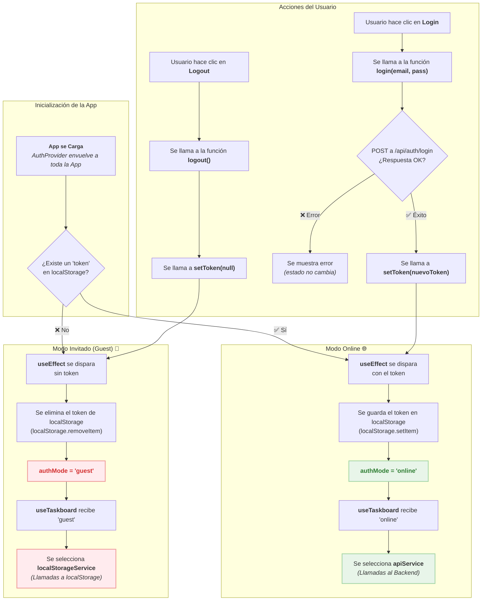

# Diagrama de Flujo del AuthContext

Este diagrama explica el ciclo de vida completo de la autenticación en la aplicación, mostrando cómo se gestionan los modos "online" y "guest".

```mermaid
graph TD
    subgraph "Inicialización de la App"
        A[<b style='font-size:14px'>App se Carga</b><br/><i>AuthProvider envuelve a toda la App</i>] --> B{¿Existe un 'token'<br/>en localStorage?};
    end

    subgraph "Modo Online 🌐"
        C[<b>useEffect</b> se dispara<br/>con el token] --> D["Se guarda el token en localStorage<br/>(localStorage.setItem)"] --> E[<b style='color:#2E7D32'>authMode = 'online'</b>];
        E --> F[<b>useTaskboard</b> recibe 'online'] --> G["Se selecciona <b>apiService</b><br/><i>(Llamadas al Backend)</i>"];
    end

    subgraph "Modo Invitado (Guest) 👤"
        H[<b>useEffect</b> se dispara<br/>sin token] --> I["Se elimina el token de localStorage<br/>(localStorage.removeItem)"] --> J[<b style='color:#D32F2F'>authMode = 'guest'</b>];
        J --> K[<b>useTaskboard</b> recibe 'guest'] --> L["Se selecciona <b>localStorageService</b><br/><i>(Llamadas a localStorage)</i>"];
    end

    subgraph "Acciones del Usuario"
        M[Usuario hace clic en <b>Login</b>] --> N["Se llama a la función <b>login(email, pass)</b>"];
        N --> O{POST a /api/auth/login<br/>¿Respuesta OK?};
        O -- ✅ Éxito --> P["Se llama a <b>setToken(nuevoToken)</b>"];
        O -- ❌ Error --> Q["Se muestra error<br/><i>(estado no cambia)</i>"];

        R[Usuario hace clic en <b>Logout</b>] --> S["Se llama a la función <b>logout()</b>"] --> T["Se llama a <b>setToken(null)</b>"];
    end

    B -- ✅ Sí --> C;
    B -- ❌ No --> H;

    P --> C;
    T --> H;

    classDef online fill:#E8F5E9,stroke:#A5D6A7,stroke-width:2px;
    classDef guest fill:#FFEBEE,stroke:#EF9A9A,stroke-width:2px;
    class E,G online;
    class J,L guest;
```
